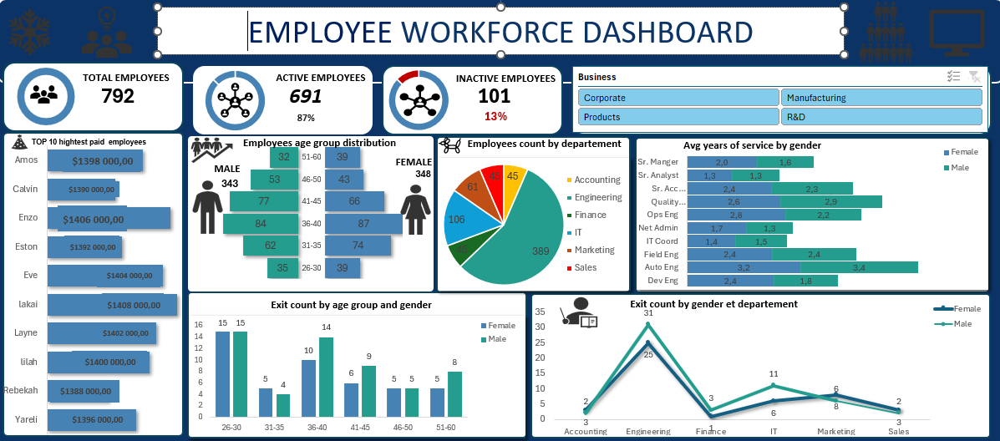

# 📊 Employee Workforce Dashboard

Ce projet présente un **tableau de bord RH interactif** conçu sous **Microsoft Excel** pour analyser la composition et la dynamique des employés d’une entreprise.

## 🎯 Objectifs
- Visualiser les effectifs (total, actifs, inactifs)
- Répartir les employés par **genre**, **âge**, **département**
- Identifier les 10 employés les mieux rémunérés
- Analyser les sorties d’employés (par âge, genre, département)
- Mesurer l’ancienneté moyenne par poste et genre

## 🛠️ Outils utilisés
- Microsoft Excel
- Graphiques dynamiques
- Segments (slicers)
- Tableaux croisés dynamiques

## 📎 Aperçu

## 🧠 Compétences développées
- Analyse de données RH
- Visualisation avec Excel
- Reporting interactif
- Data storytelling

---

🔗 **Projet réalisé dans le cadre de mon apprentissage en Data Analysis.**

